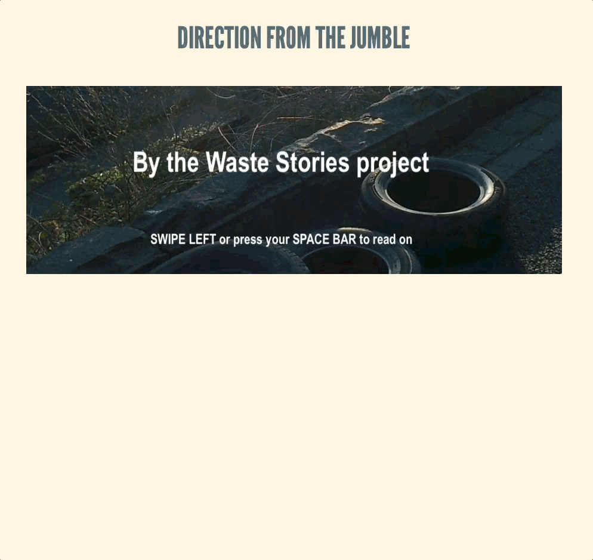

= A presentation of a verse that was written for the Waste Stories project

👁️ https://ash-mcc.github.io/waste-stories-jumble-verse/[View] the generated web page.

=== A screenshot

=== Building a 'static' web page from the source

[source]
----
make
----
